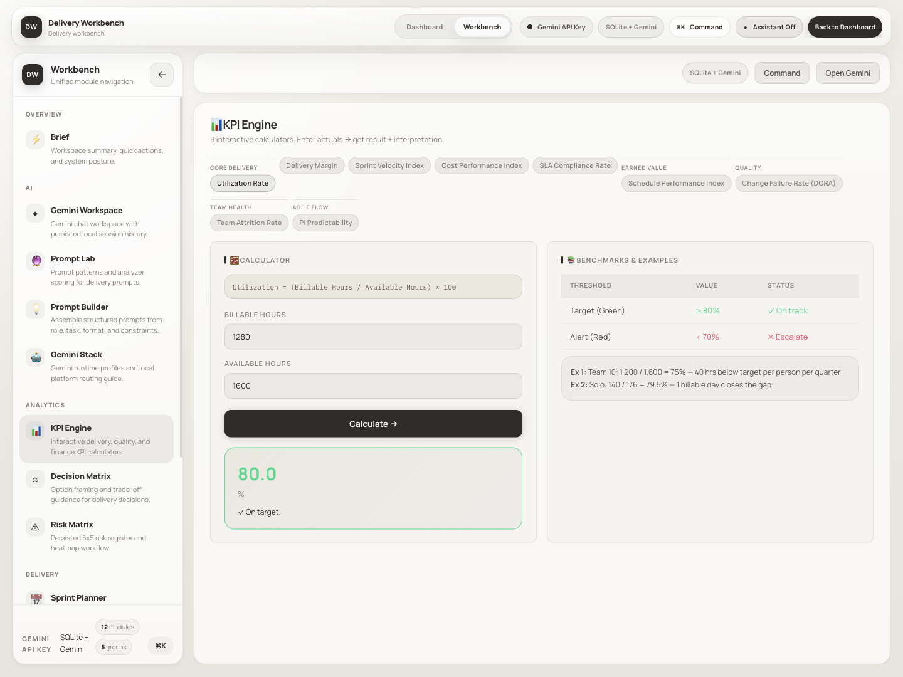
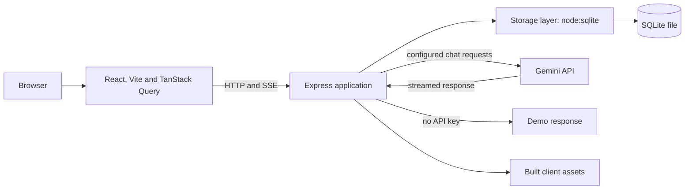

# Delivery Workbench

A delivery-planning workspace for KPI calculations, risk assessment, sprint capacity, estimates, and AI-assisted analysis.

Delivery Workbench brings a set of related planning tools into one keyboard-accessible interface. It combines a React client with an Express server, local SQLite persistence, and optional streaming Gemini chat. The project demonstrates a compact full-stack application that can run as a single service.



*Actual local application with seeded example data. Previously named AKB1 Command Center.*

**Status:** portfolio prototype. The previous hosted demo is unavailable; the local walkthrough below is the supported starting point.

[Run locally](#run-locally) · [Architecture](#architecture) · [Code guide](#code-guide)

## Capabilities

| Area | Included tools |
| --- | --- |
| Delivery planning | Sprint capacity, estimation, pricing, decision comparison |
| Reporting | KPI calculators, risk register, status-report drafts |
| AI assistance | Streaming chat with saved sessions and a delivery-oriented system prompt |
| Prompt tooling | Prompt templates, a structured prompt builder, and model guidance |
| Workspace | Command palette, responsive navigation, persisted tool drafts |

Calculators and reports operate on entered values and seeded examples. They are not automatic integrations with a company's delivery systems. Without a Gemini key, chat uses a demonstration response.

## Architecture



Persistence uses Node's built-in `node:sqlite` directly. Drizzle-related files remain in the repository, but the running storage layer is [server/storage.ts](server/storage.ts). Express serves the API and the built frontend in production; Vite is attached during development.

## Run locally

Requires **Node.js 25.6.0 or newer**, as specified by the package, and npm.

```bash
git clone https://github.com/anudeepadi/delivery-workbench.git
cd delivery-workbench
npm ci
cp .env.example .env
npm run dev
```

Open [localhost:5000](http://localhost:5000). SQLite tables and seed data are initialized by the storage layer. No external database service is required.

| Variable | Default / purpose |
| --- | --- |
| `PORT` | `5000` |
| `HOST` | Loopback in development; all interfaces in production |
| `SQLITE_DB_PATH` | `data/akb1.sqlite` |
| `GEMINI_API_KEY` | Optional; enables provider-backed chat |
| `GEMINI_MODEL` | `gemini-2.5-flash`, subject to provider availability |

The server loads `.env` at startup. Chat requests send conversation context to Gemini when configured; saved history remains in the application's database.

## Five-minute walkthrough

1. Select **Open Workbench** and choose **KPI Engine**.
2. Change a calculator input and inspect the formula and calculated result.
3. Open **Risk Matrix** or **Sprint Planner** to explore the sample planning tools.
4. Edit a tool draft, reload the page and confirm it is restored from SQLite.
5. Open chat without setting a key to see the clearly labeled demo response.

There is no live connection to a company delivery system. Seeded figures and benchmarks are illustrative and should be reviewed for your context.

## Build and check

```bash
npm run check
npm run build
npm start
```

Type checking, the production build, health endpoint, local draft persistence and no-key chat were checked on 22 September 2026 with Node.js 26.9.0. No Gemini requests were made.

`GET /api/health` is the health endpoint. There is no test command declared in the package; type checking and building are the available baseline checks.

For a container deployment, use the included [Dockerfile](Dockerfile) and persist the SQLite directory on a volume. A disposable container filesystem will not preserve chat history or drafts across replacements.

## Code guide

| Path | Responsibility |
| --- | --- |
| [client/src/components/tabs/](client/src/components/tabs/) | Planning and reporting modules |
| [client/src/hooks/use-tool-draft.ts](client/src/hooks/use-tool-draft.ts) | Draft persistence from the UI |
| [server/routes.ts](server/routes.ts) | Bootstrap, sessions, drafts, and streaming chat |
| [server/storage.ts](server/storage.ts) | SQLite schema, seeds, and data access |
| [shared/contracts.ts](shared/contracts.ts) | Client/server domain contracts |
| [script/build.ts](script/build.ts) | Frontend and server build |

## Scope and contributions

This is a portfolio application with a shared workspace, not a tenant-isolated enterprise product. The current routes do not provide per-user authentication and authorization. Keep personal experimentation local; hosted multi-user use needs an access-control design.

Useful contributions include calculator examples, input validation, accessibility improvements, and tests for persistence and streaming. Describe the affected module and include steps to reproduce any behavior change.

## License

[package.json](package.json) declares MIT, but a standalone license file is not currently tracked. Clarify repository-wide licensing before redistributing a release.
